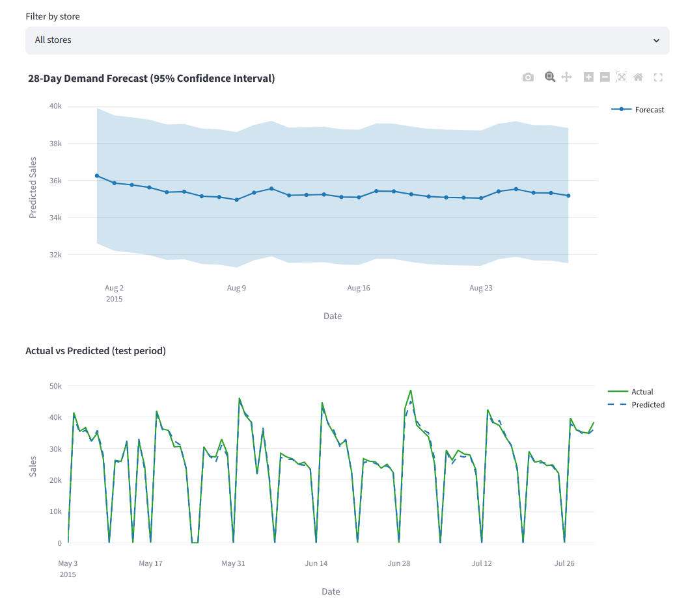
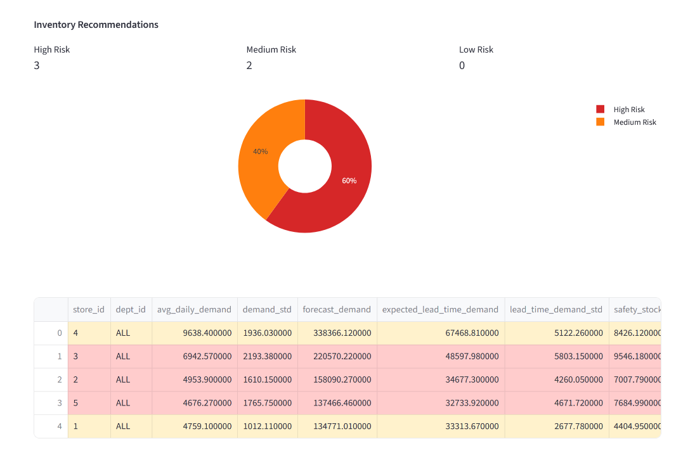
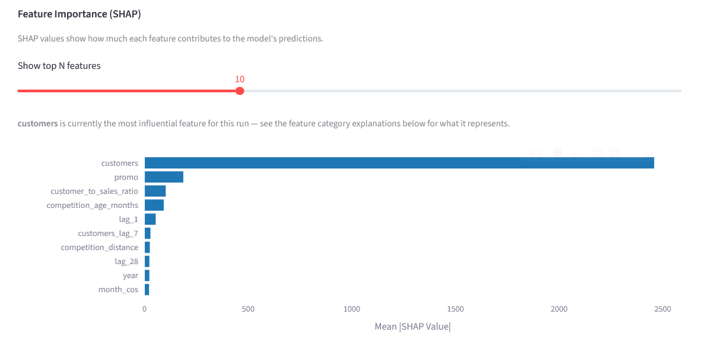
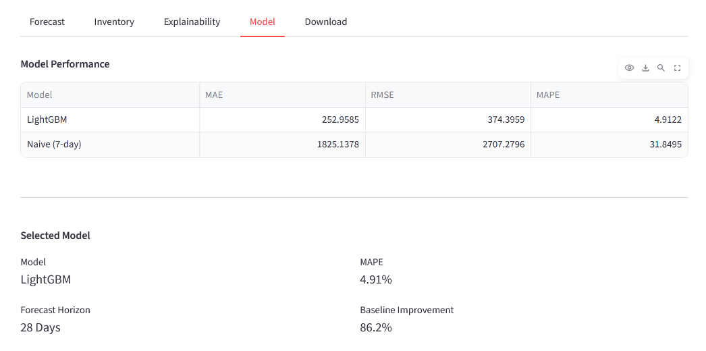

# Retail Demand Forecasting & Inventory Optimization

Retail Demand Forecasting & Inventory Optimization is an end-to-end machine learning application that predicts product demand, recommends reorder quantities, and generates inventory risk insights from uploaded retail sales data. Users upload a CSV, train a forecasting model, compare its performance against a naive baseline, interpret predictions with SHAP, and export an executive report.

---

## Results

<!--
Fill this in with real numbers from an actual run on your sample/demo
dataset before publishing. Do not leave placeholder values in the
published README.
-->

| Metric | Value |
|---|---|
| Selected model | LightGBM |
| MAPE | 4.9122 |
| Baseline MAPE (naive 7-day) | 31.8495 |
| Improvement over baseline | 86.2% |
| Forecast horizon | 28 days |

## Highlights

- 28-day recursive multi-day forecasting, rewritten from an O(n²) to an O(1) per-step computation — reduced forecast runtime from approximately 40 minutes to approximately 12 seconds at scale
- SHAP-based feature importance and per-feature explanations
- Segmented error analysis (by store, weekday/weekend, demand tier) and residual diagnostics, not just a single accuracy number
- Inventory risk classification via coefficient of variation, rather than a constant service-level assumption
- Session-scoped Postgres persistence with best-effort writes that never block the pipeline
- 49 automated tests, run on every push via GitHub Actions

## Business Impact

- Reduce stockouts through per-SKU safety stock and reorder point recommendations
- Reduce excess inventory by right-sizing stock to actual demand volatility, not a flat assumption
- Forecast demand up to 56 days ahead to support purchasing and staffing decisions
- Identify high-risk SKUs before a stockout occurs, using volatility-based risk classification
- Support replenishment decisions with an exportable executive report

## Screenshots

<!--
Add 4 screenshots from the live app before publishing:
  1. Forecast tab  — screenshots/forecast.png
  2. Inventory tab — screenshots/inventory.png
  3. Explainability tab (SHAP + error analysis) — screenshots/explainability.png
  4. Model tab (metrics + residual plots) — screenshots/model.png
Then replace this comment with:
  
  
  
  
-->

*Screenshots to be added — see the live demo link above in the meantime.*

## Tech Stack

**Core:** Python, LightGBM, PostgreSQL, Streamlit, Docker, SHAP

**Also used:** XGBoost, Random Forest, Plotly, NumPy, pandas, SQLAlchemy, pytest, GitHub Actions

---

## Overview

Retail businesses need to answer two operational questions from historical sales data: how much will we sell in the coming weeks, and how much stock should we hold to avoid running out or overstocking. This project implements a full pipeline addressing both, starting from an arbitrary user-uploaded CSV (column names are auto-detected and mapped) through model training and evaluation, a recursive multi-day forecast, and inventory recommendations with per-SKU risk classification.

The application is designed as a public Streamlit demo, but architected with production concerns in mind: a normalized Postgres schema, session-scoped multi-tenant data isolation, best-effort persistence that never blocks the core pipeline, and a Dockerized deployment using a multi-stage build and a non-root user.

## Architecture

```
CSV Upload
    │
    ▼
Column Detection & Mapping   (handles arbitrary column names/aliases)
    │
    ▼
Data Validation              (blocking errors vs. warnings)
    │
    ▼
Demo Capacity Guard          (time-series-safe row sampling for shared demo)
    │
    ▼
Feature Engineering          (lag, rolling, calendar, retail covariates)
    │
    ▼
Train/Test Split             (time-based split, no leakage)
    │
    ▼
Model Training                (XGBoost / LightGBM / Random Forest)
    │
    ▼
Evaluation & SHAP              (MAE / RMSE / MAPE + explainability)
    │
    ▼
Recursive Future Forecast       (O(1) per-step buffer computation)
    │
    ▼
Inventory Optimization           (safety stock, reorder point, CV-based risk)
    │
    ▼
Executive Summary & Export        (KPI rollup, Excel export)
    │
    ▼
Postgres Persistence               (best-effort, session-scoped)
```

## Key Features

**Flexible data ingestion**
Upload any retail sales CSV — the app detects `date`/`sales` and a wide range of optional columns (`store_id`, `dept_id`, `sell_price`, `promo`, `competition_distance`, calendar/holiday flags, etc.) via alias matching, and validates the data before it reaches the model.

**Leakage-safe feature engineering**
Lag features (1/7/14/28 days), rolling mean/std (7/14/30 days), cyclical calendar encoding, price/promo/competition covariates — all derived strictly from `t-1` or earlier.

**Multi-model training**
Choice of XGBoost (with `RandomizedSearchCV` + `TimeSeriesSplit` hyperparameter search), LightGBM (fast defaults, used for the live demo), or Random Forest — evaluated against a naive 7-day baseline. LightGBM was chosen as the default for the deployed application specifically because it trains significantly faster than XGBoost's hyperparameter search on the memory-constrained free-tier instance, at comparable accuracy.

**Recursive multi-day forecasting, optimized for speed**
Forecasting 28+ days ahead recursively (each day's prediction feeds the next day's lag features) was originally an O(n²) operation, re-running full feature engineering on a growing history at every step. It has been rewritten to compute lag/rolling features directly from a NumPy buffer in O(1) per step, reducing forecast runtime from approximately 40 minutes to approximately 12 seconds at scale.

**SHAP explainability**
Feature importance via SHAP `TreeExplainer`, with a graceful fallback to native `feature_importances_` if SHAP fails on a given model.

**Segmented error analysis and residual diagnostics**
Test-period error is broken down by store, weekday/weekend, and demand tier, and by residual scatter/distribution plots — not just a single aggregate accuracy metric. This surfaces where and why the model is wrong, such as forecast error scaling with demand volume, which directly informs the volatility-based inventory risk design below.

**Inventory optimization with per-SKU risk classification**
Safety stock and reorder points are computed from lead-time demand and its standard deviation, scaled by a service-level z-score. Risk level is classified by coefficient of variation (standard deviation divided by mean demand) on open-trading days only, rather than a constant service-level-derived probability — this means SKUs get genuinely differentiated risk levels instead of all showing an identical stockout probability. The full formulas are documented in-app in the Inventory tab.

**Postgres persistence, safely scoped for a public demo**
- Every pipeline run is saved (forecasts, model metrics, inventory recommendations) under a random per-browser-session ID
- "Load Previous Run" only ever shows runs from the same session — no cross-user data leakage on the shared public deployment
- All database writes are best-effort: if Postgres is unreachable, the pipeline still completes and the user sees their results; only persistence is skipped
- Actuals can later be uploaded and joined against past forecasts using window functions (`AVG() OVER (ROWS BETWEEN 6 PRECEDING AND CURRENT ROW)`, `RANK()`) to compute rolling forecast-error trends per store/dept, computed in Postgres rather than pandas

**Demo capacity guard**
On the memory-constrained free-tier deployment, oversized uploads are sampled down via `MAX_DEMO_ROWS` — never by randomly dropping rows, which would corrupt lag/rolling features, but by keeping whole stores' history intact or the most recent contiguous date window.

**Excel and CSV export**
A formatted, color-coded multi-sheet Excel workbook (Executive Summary, Forecast Results, Inventory Recommendations, Model Performance, Feature Importance, Future Forecast) plus individual CSV downloads.

## Project Structure

```
.
├── app.py                # Streamlit entrypoint
├── ui/                   # Sidebar, upload/run/results flow, and per-tab views
├── src/                  # Feature engineering, training, forecasting, inventory logic
├── db_layer/             # Postgres connection, repository, schema
├── tests/                # 49 pytest tests
├── .github/workflows/    # CI — runs the test suite on every push
├── Dockerfile
├── docker-compose.yml
└── requirements.txt
```

See individual module docstrings for details on any given file.

## Getting Started

### Quick local run (no Docker, no Postgres required)

```bash
pip install -r requirements.txt --break-system-packages
streamlit run app.py
```

The application runs fully without a database connection. Persistence is best-effort and is silently skipped if Postgres is unreachable.

### Full stack with Docker Compose

```bash
docker-compose up --build
```

Requires a `.env` file in the repo root with at least `DB_PASSWORD` set. Visit `http://localhost:8501`.

### Configuration

Database credentials are read from environment variables (local/Docker) or `st.secrets` (Streamlit Community Cloud) — see `db_layer/connection.py`. Required keys: `DB_HOST`, `DB_PORT`, `DB_NAME`, `DB_USER`, `DB_PASSWORD`, and optionally `DB_SSLMODE` (set to `require` for managed Postgres like Neon or RDS).

## Testing

```bash
pip install pytest --break-system-packages
pytest tests/ -v
```

49 tests covering data validation and column detection, preprocessing and categorical encoding, forecast evaluation metrics, inventory risk classification and safety stock math, segmented error analysis, and the O(1) recursive forecast buffer — verified against a from-scratch reference implementation. A GitHub Actions workflow runs the full suite on every push to `main`.

Writing tests for the recursive forecast buffer surfaced two real defects, subsequently fixed: rolling mean and standard deviation were computed one day stale relative to the training-time feature definitions, and standard deviation used population variance rather than sample variance, matching the training-time convention. Both issues affected live forecast quality and downstream inventory risk scoring prior to the fix.

## Known Limitations (by design, for a public demo)

- Session isolation via a random per-browser-session ID is a privacy boundary, not authentication — acceptable for a public demo, not a substitute for real multi-tenant auth.
- The `MAX_DEMO_ROWS` capacity guard trades off dataset completeness for staying within free-tier memory limits; local and full-scale runs are uncapped.
- No scheduling or orchestration layer (such as Airflow): the pipeline runs synchronously on user interaction rather than as a recurring batch job, so an orchestrator is not the right fit for this deployment model.

## Author

**Arnav Modi** — B.Tech Information Technology, Maharaja Surajmal Institute of Technology
